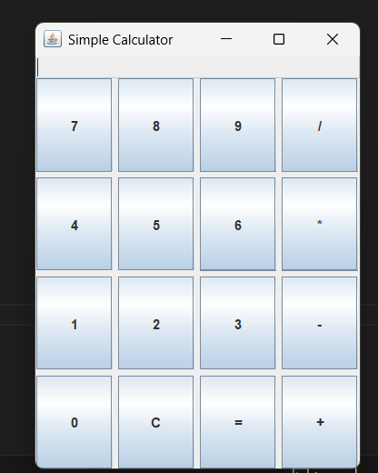

# 🧮 Simple Java GUI Calculator  


A clean and simple **Graphical User Interface (GUI)** calculator built using **Java Swing**.  
This project performs basic arithmetic operations — **addition, subtraction, multiplication, and division** — in an intuitive interface designed for beginners learning GUI development in Java.

---

## 📸 Screenshot


---

## ⚙️ Features
- ✅ Simple and clean user interface  
- ✅ Performs basic arithmetic operations (+, −, ×, ÷)  
- ✅ Built using **Java Swing** and **AWT**  
- ✅ Beginner-friendly project for understanding Java GUI layouts  

---

## 🚀 How to Run

1. **Clone this repository**
   ```bash
   git clone https://github.com/Bodhisattb/Java-GUI-Calculator.git
